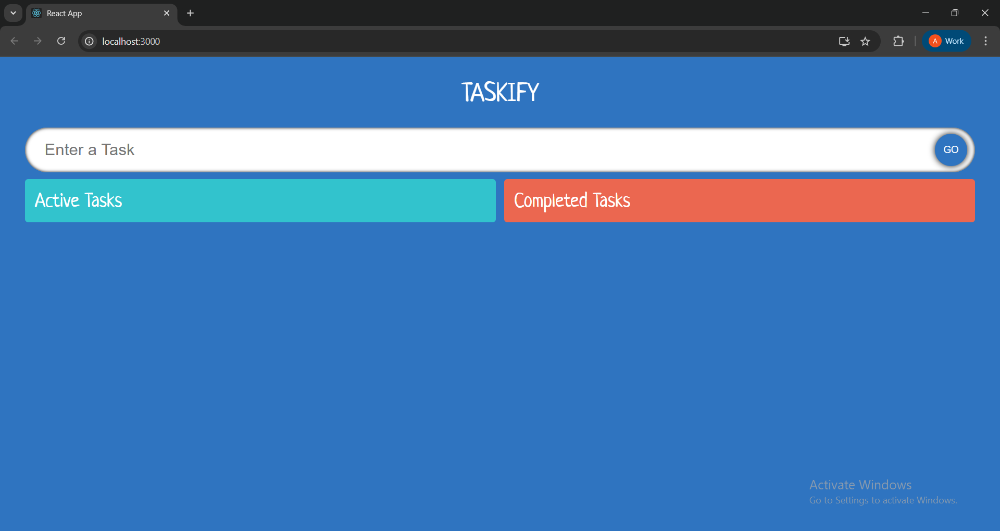
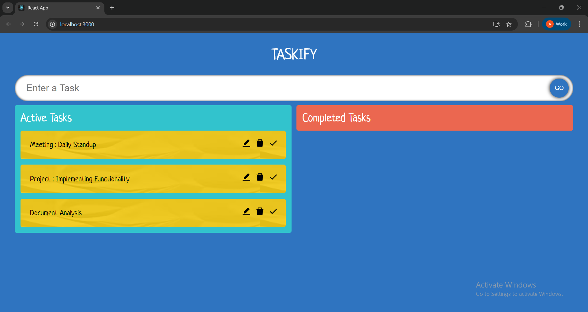
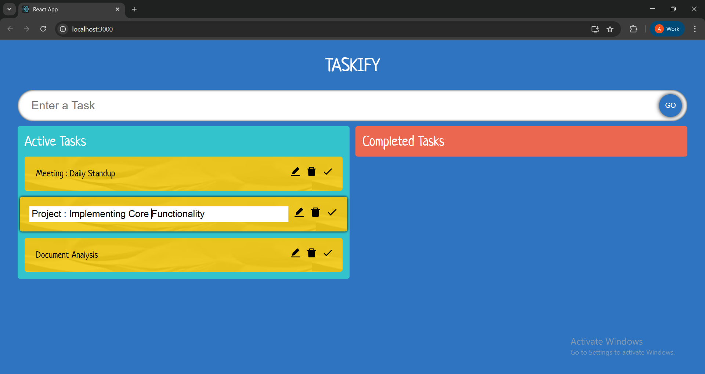
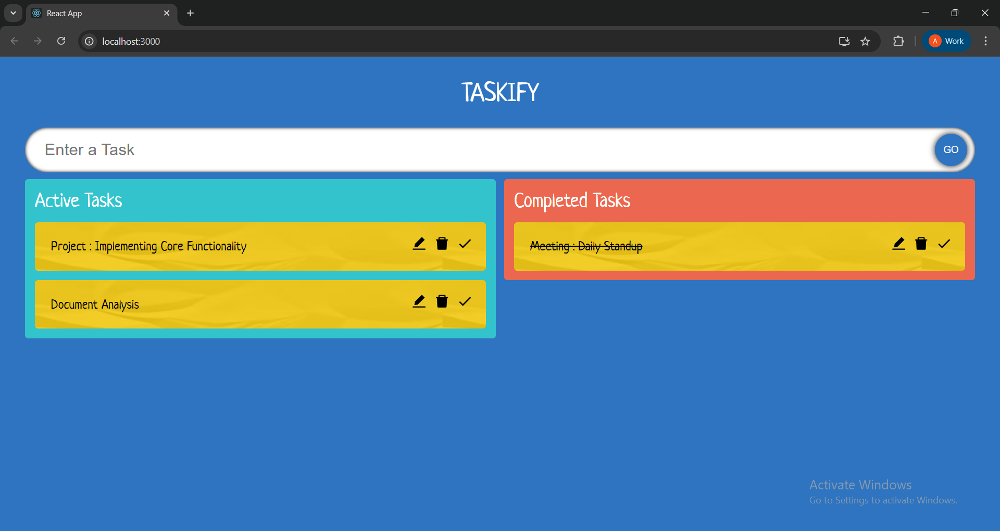
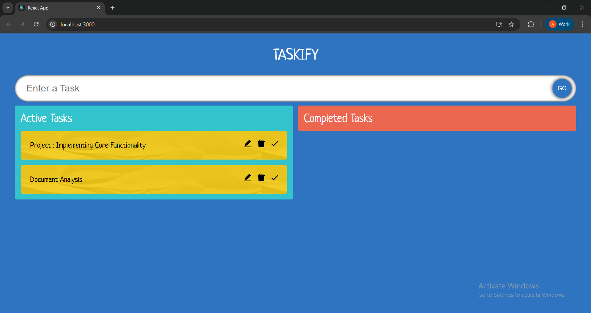

# Taskify App

## Overview

**Taskify** is a simple and interactive task management app built using **React** and **TypeScript**. It allows users to manage their tasks effectively with features like adding, editing, completing, deleting, and drag-and-drop functionality.

##  Features

-  **Add Tasks**: Quickly add new tasks to the **Active Tasks** section.
-  **Edit Tasks**: Inline editing of task names.
-  **Complete Tasks**: Click the tick mark to strike through and mark tasks as completed.
-  **Drag and Drop**: Move tasks between **Active** and **Completed** sections using drag-and-drop.
-  **Delete Tasks**: Easily delete a task using the delete icon.
-  **Smooth User Experience**: Interactive and responsive UI built with TypeScript and modern React patterns.

##  Technologies Used

-  **React** 
-  **TypeScript** 
-  **HTML** 
-  **CSS** 

## Screenshots

### Home Screen

 
---

### Active Tasks

 
---

### Edit Task

---

### Completed Tasks

---

### Strike-through Effect

---

### Delete Task

